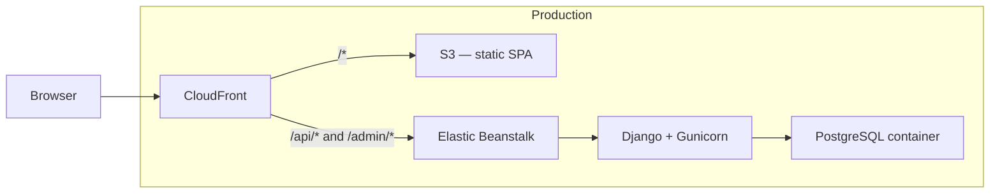
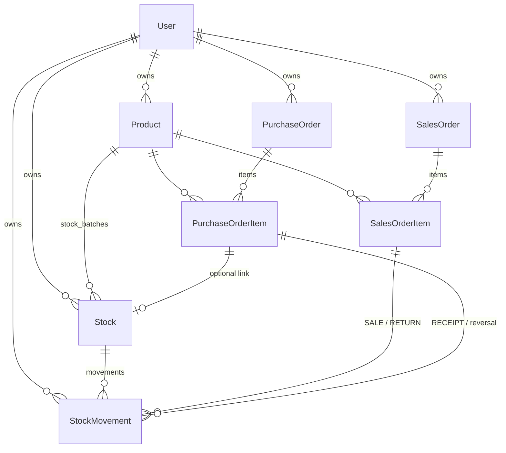

# Architecture

KaiznBonsai is an inventory management app for Food & Beverage CPG brands. Users register, manage a product catalog, track stock in traceable batches, record purchase and sales orders, and view financial performance.

For domain rules (ledger, orders, allocation), see [Inventory & orders](domain/inventory-and-orders.md). For metric definitions, see [Financials](domain/financials.md).

---

## System context

Production serves the React SPA and Django API from a **single CloudFront origin**. Local development runs three Docker Compose services (Postgres, backend, frontend).



| Layer | Technology |
|-------|------------|
| Frontend | React 18, TypeScript, Vite, Mantine, Tailwind, TanStack Query |
| Backend | Django 6, Django REST Framework, PostgreSQL |
| Auth | JWT access token (JSON) + httpOnly refresh cookie |
| API docs | drf-spectacular (Swagger `/api/docs/`, ReDoc `/api/redoc/`) |
| Infrastructure | AWS CDK — CloudFront, S3, Elastic Beanstalk, ECR |

Deploy details: [infrastructure/README.md](../infrastructure/README.md).

---

## Backend structure

Django apps live under `backend/apps/`:

| App | Responsibility |
|-----|----------------|
| `accounts` | Email-based user registration and JWT auth |
| `inventory` | Products, stock batches, movement ledger, financial selectors |
| `orders` | Purchase and sales orders, confirm/cancel commands, FIFO/FEFO allocation |
| `assistant` | Optional AI chat (Anthropic); read-only tools over existing selectors |
| `core` | Shared abstractions (`TenantOwnedModel`, cursor pagination) |

All API routes are versioned under **`/api/v1/`**.

### CQRS lite

State changes live in **`commands.py`** (e.g. `confirm_sales_order`, `record_movement`). Reads and aggregates live in **`selectors.py`** (e.g. `get_overall_financials`, `list_stock_movements`). DRF views authenticate, validate input, call a command or selector, and serialize the response.

This keeps side effects explicit and lets tests call business logic without HTTP.

### Write path (example)

Confirming a sales order:

```
POST /api/v1/orders/sales-orders/{id}/confirm/
  → SalesOrderViewSet.confirm
  → confirm_sales_order (orders/commands.py)
  → record_movement (inventory/commands.py) per batch deduction
  → StockMovement rows + updated Stock.current_quantity
```

Every quantity change after batch creation goes through `record_movement()` — see [Inventory & orders](domain/inventory-and-orders.md).

---

## Data model (overview)



| Entity | Notes |
|--------|--------|
| **User** | Login via `email` (`USERNAME_FIELD`); `username` exists for Django admin only |
| **Product** | Name, description, SKU (unique per user), unit of measure (`KG`, `G`, `L`, `ML`, `UNIT`) |
| **Stock** | UUID batch: lot code, optional `best_before`, `unit_cost`, `initial_quantity`, `current_quantity`, optional `voided_at` |
| **StockMovement** | Append-only ledger row: `delta`, `reason`, links to batch and optionally order line |
| **PurchaseOrder / SalesOrder** | `DRAFT` → `CONFIRMED` or `CANCELLED`; optional title |
| **Order items** | Line-level quantity and unit cost (PO) or unit price (SO); scoped to parent order's user |

Tenant-owned models (`Product`, `Stock`, `StockMovement`, orders) extend `TenantOwnedModel` with a required `user` foreign key.

---

## Access control and data ownership

Each account is an **independent inventory tenant**. Every business record — products, batches, movements, and orders — is owned by the authenticated user through `TenantOwnedModel` (`user` foreign key, `created_at`, `updated_at`).

Enforcement is layered:

| Layer | Mechanism |
|-------|-----------|
| **API reads** | View querysets filter on `request.user` — users only list and retrieve their own rows. |
| **API writes** | Commands validate that referenced products and batches belong to the acting user before creating order lines or movements. |
| **Assistant** | Chat tools call the same selector layer; no cross-user reads. |


---

## Authentication

| Endpoint | Purpose |
|----------|---------|
| `POST /api/v1/auth/register/` | Create account (email + password) |
| `POST /api/v1/auth/login/` | Returns `access` token and `user` in JSON; sets `refresh_token` httpOnly cookie |
| `POST /api/v1/auth/token/refresh/` | Reads refresh token from cookie only; returns new access token |
| `POST /api/v1/auth/logout/` | Blacklists refresh token, clears cookie |
| `GET /api/v1/auth/me/` | Current user profile |

**Frontend:** access token held in memory; axios attaches `Authorization: Bearer …` and retries on 401 via silent cookie refresh (`frontend/src/api/client.ts`).

**Production:** frontend and API share the CloudFront origin, so CORS is only needed in local dev (`CORS_ALLOWED_ORIGINS`).

---

## Security configuration

| Setting | Behavior |
|---------|----------|
| `ALLOWED_HOSTS` | Comma-separated env var; production includes CloudFront hostname and `.elasticbeanstalk.com` for health checks |
| Default DRF permission | `IsAuthenticated` on all endpoints except register/login/refresh |
| Refresh token | Never returned in JSON; httpOnly cookie only |

---

## Frontend structure

Client-side routing (`frontend/src/App.tsx`). Authenticated pages use `AppLayout` (drawer navigation).

| Route | Page |
|-------|------|
| `/` | Home — period KPIs, attention cards, recent movements |
| `/financials` | P&L summary and per-product performance table |
| `/inventory/products` | Product catalog and stock drawer |
| `/orders/purchases` | Purchase orders (`?status=draft\|confirmed\|cancelled`; `?orderId=` opens detail modal) |
| `/orders/sales` | Sales orders (same query params) |
| `/history` | Stock movement audit trail |

Data fetching uses TanStack Query hooks in `frontend/src/api/`. Mutations invalidate related query keys (e.g. orders → stocks and financials).

**Optional:** AI assistant FAB on Home and Financials (`POST /api/v1/assistant/chat/`). Requires `ANTHROPIC_API_KEY` on the server; returns 503 if unset.

---

## API surface (summary)

Full request/response schemas: **Swagger** at `/api/docs/`.

| Prefix | Resources |
|--------|-----------|
| `/api/v1/auth/` | Register, login, refresh, logout, me |
| `/api/v1/inventory/products/` | Product CRUD |
| `/api/v1/inventory/stocks/` | Stock batches; `POST …/void/`; `GET …/movements/` |
| `/api/v1/inventory/movements/` | Tenant-wide movement list (filtered, paginated) |
| `/api/v1/inventory/financials/` | Overall and per-product financial aggregates |
| `/api/v1/orders/purchase-orders/` | PO CRUD; list accepts `?status=`; `POST …/confirm/`, `POST …/cancel/` |
| `/api/v1/orders/sales-orders/` | SO CRUD; list accepts `?status=`; confirm (with optional `allocation_strategy`); cancel |
| `/api/v1/assistant/chat/` | AI chat (optional) |

Lifecycle endpoints (confirm, cancel, void) are documented in [Inventory & orders](domain/inventory-and-orders.md).

---

## Testing

Backend tests use **pytest** against the Dockerized Postgres instance (same engine as production):

```bash
docker compose up -d db
docker compose exec backend pytest
```

CI runs the same on push/PR to `main` when backend files change (`.github/workflows/test.yml`).

---

## Design boundaries

Documented limits of this build — distinct from the core inventory flows above.

| Area | Choice |
|------|--------|
| **Production database** | PostgreSQL runs on the same Elastic Beanstalk instance as Django (not RDS). Keeps deploy cost and complexity down; see [infrastructure/README.md](../infrastructure/README.md). |
| **Adjustments** | Quantity corrections apply to unconsumed, manually entered batches. Shrinkage on partially sold batches would need a separate workflow — see [Inventory & orders](domain/inventory-and-orders.md). |
| **PO cancellation** | A confirmed PO can be reversed only while its batches are untouched by sales; see domain doc for the full rule. |

Business rules and movement invariants: [Inventory & orders](domain/inventory-and-orders.md).
