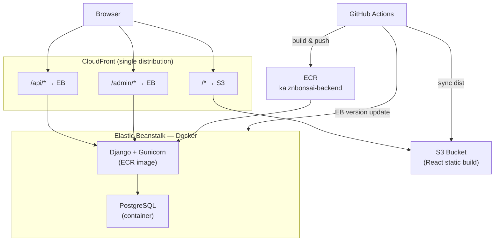

# KaiznBonsai — AWS Infrastructure

Infrastructure-as-code for deploying KaiznBonsai to AWS (CDK, Python). Application design: [`docs/architecture.md`](../docs/architecture.md).

## Topology



| Component | Service | Role |
|-----------|---------|------|
| Frontend + API | S3 + CloudFront | Single distribution; `/api/*` and `/admin/*` route to EB; `/*` serves S3 |
| Backend | Elastic Beanstalk + ECR | Django (Gunicorn) + Postgres via Docker Compose |
| Registry | ECR | `kaiznbonsai-backend` image |
| EB bundles | S3 | Application version manifests (compose zip) |

Postgres runs on the same EB instance as Django (not RDS). See [`docs/architecture.md`](../docs/architecture.md#known-compromises).

## Configuration

Production EB environment variables are set at **`cdk deploy`** time from `infrastructure/.env` (template: `.env.example`). `backend_stack.py` reads that file and writes values into the EB environment.

| Variable | Purpose |
|----------|---------|
| `ALLOWED_HOSTS` | Comma-separated Django host allowlist. Include the CloudFront distribution hostname and `.elasticbeanstalk.com` so ELB health checks succeed. |

## Stacks

`BackendStack` must be deployed first — `FrontendStack` takes the EB endpoint URL as a constructor parameter to wire the `/api/*` and `/admin/*` CloudFront behaviors.

| Stack | Creates |
|-------|---------|
| `KaiznBonsaiBackendStack` | ECR, EB app/env, EB deploy bucket |
| `KaiznBonsaiFrontendStack` | S3 bucket, CloudFront with path-based routing to EB |

## CDK deploy

```bash
cd infrastructure
python3 -m venv .venv && source .venv/bin/activate
pip install -r requirements.txt
cp .env.example .env   # fill in values

cdk deploy KaiznBonsaiBackendStack
cdk deploy KaiznBonsaiFrontendStack
```

### CDK outputs → CI variables

| CDK output | GitHub Actions secret (`prod` environment) |
|------------|---------------------------------------------|
| `CloudFrontURL` | — (live URL for both frontend and API) |
| `FrontendBucketName` | `S3_WEB_BUCKET` |
| `CloudFrontDistributionId` | `CLOUDFRONT_DIST_ID` |
| `EBDeployBucketName` | `EB_DEPLOY_BUCKET` |
| `EBEnvironmentURL` | Internal EB endpoint — not exposed publicly |
| — | `DEMO_USER_PASSWORD` (prod environment secret for `seed-demo.yml`) |

Workflows assume IAM role `GitHubActionsKaiznBonsaiRole` via OIDC.

## CI/CD

| Workflow | Triggers on `main` | Action |
|----------|-------------------|--------|
| `test.yml` | `backend/**`, `docker-compose.yml` | Run pytest in Docker |
| `deploy-web.yml` | `frontend/**`, `frontend_stack.py` | Build → S3 sync → CloudFront invalidation |
| `deploy-backend.yml` | `backend/**`, `backend_stack.py` | Build image → ECR push → EB version update |
| `seed-demo.yml` | Manual (`workflow_dispatch`) | Seed `demo@example.com` on production via SSM |

### Backend deploy flow

1. Build `backend/Dockerfile.prod` → push to ECR as `kaiznbonsai-backend:latest`
2. Substitute `__BACKEND_IMAGE__` in `backend/docker-compose.yml` (CI workspace only; committed file keeps the placeholder)
3. Zip the compose manifest → upload to the EB deploy bucket
4. Create EB application version → update `KaiznBonsai-Prod`

### Demo seed on production

Run the **Seed Demo Data** workflow in GitHub Actions (`seed-demo.yml`). It runs `python manage.py generate_seed_data` on the EB instance via SSM. Only data owned by `demo@example.com` is reset — other users are untouched. The demo password comes from the `DEMO_USER_PASSWORD` GitHub secret (prod environment).

## Local development

Local dev does not use CDK. From the repo root: `cp .env.example .env` → `docker compose up --build`. See root `README.md`.
