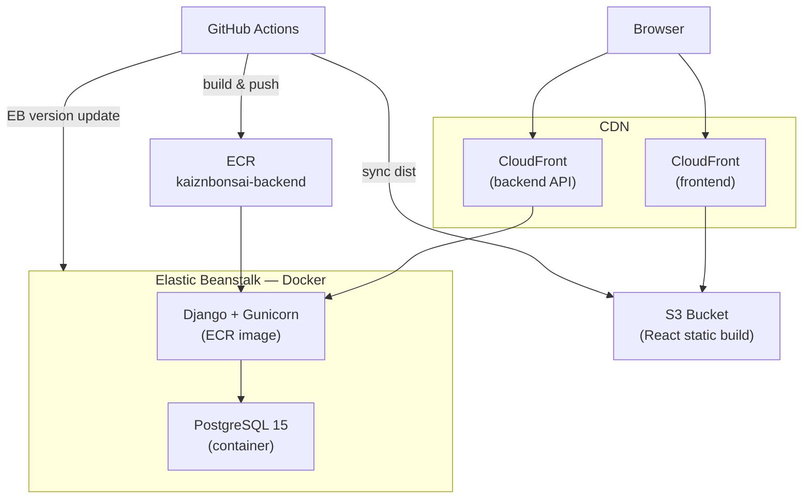

# KaiznBonsai — AWS Infrastructure

Infrastructure-as-code for deploying KaiznBonsai to AWS (CDK, Python). Application design decisions: [`docs/architecture.md`](../docs/architecture.md).

## Topology



| Component | Service | Role |
|-----------|---------|------|
| Frontend | S3 + CloudFront | Static React build |
| Backend | Elastic Beanstalk + ECR | Django (Gunicorn) + Postgres via Docker Compose |
| API HTTPS | CloudFront (backend) | TLS; caching disabled; all methods forwarded |
| Registry | ECR | `kaiznbonsai-backend` image |
| EB bundles | S3 | Application version manifests (compose zip) |

Postgres runs on the same EB instance as Django (not RDS). See [`docs/architecture.md`](../docs/architecture.md#infrastructure--database-deployment).

## Configuration

Production Elastic Beanstalk environment variables are set at **`cdk deploy`** time from `infrastructure/.env` (template: `.env.example`). `backend_stack.py` reads that file and writes values into the EB environment.

Deploy the frontend stack first, then set `CORS_ALLOWED_ORIGINS` in `infrastructure/.env` to the `CloudFrontURL` output before deploying the backend stack.

## Stacks

| Stack | Creates |
|-------|---------|
| `KaiznBonsaiFrontendStack` | S3 bucket, CloudFront (SPA 404 → `index.html`) |
| `KaiznBonsaiBackendStack` | ECR, EB app/env, EB deploy bucket, backend CloudFront |

## CDK deploy

```bash
cd infrastructure
python3 -m venv .venv && source .venv/bin/activate
pip install -r requirements.txt
cp .env.example .env   # fill in values

cdk deploy KaiznBonsaiFrontendStack
# Set CORS_ALLOWED_ORIGINS in .env to the CloudFrontURL output
cdk deploy KaiznBonsaiBackendStack
```

### CDK outputs → CI variables

| CDK output | GitHub Actions secret (`prod` environment) |
|------------|---------------------------------------------|
| `CloudFrontURL` | — (live frontend URL) |
| `FrontendBucketName` | `S3_WEB_BUCKET` |
| `CloudFrontDistributionId` | `CLOUDFRONT_DIST_ID` |
| `BackendCloudFrontURL` | `VITE_API_URL` |
| `EBDeployBucketName` | `EB_DEPLOY_BUCKET` |

Workflows assume IAM role `GitHubActionsKaiznBonsaiRole` via OIDC.

## CI/CD

| Workflow | Triggers on `main` | Action |
|----------|-------------------|--------|
| `deploy-web.yml` | `frontend/**` | Build → S3 sync → CloudFront invalidation |
| `deploy-backend.yml` | `backend/**`, `backend_stack.py` | Build image → ECR push → EB version update |

### Backend deploy flow

1. Build `backend/Dockerfile.prod` → push to ECR as `kaiznbonsai-backend:latest`
2. In CI only: substitute `__BACKEND_IMAGE__` in a copy of `backend/docker-compose.yml` (the committed file keeps the placeholder)
3. Zip the compose manifest → upload to the EB deploy bucket
4. Create EB application version → update `KaiznBonsai-Prod`

## Local development

Local dev does not use CDK. From the repo root: `cp .env.example .env` → `docker compose up --build`. See root `README.md`.
